# 鬥地主AI
# <a herf="https://github.com/kwai/DouZero">DouZero</a>
- Model
- Deep Monte Carlo
- Card Encoding
- Action and State
- Reward
- legal combinations
- Algorithms

    -----

    ### Model
    * value Base 方法: Input (State 和 action)  得到 Q
    * LSTM 用於編碼歷史動作
    * 架構 : 使用6層隱藏層大小為512的MLP來生成Q值

    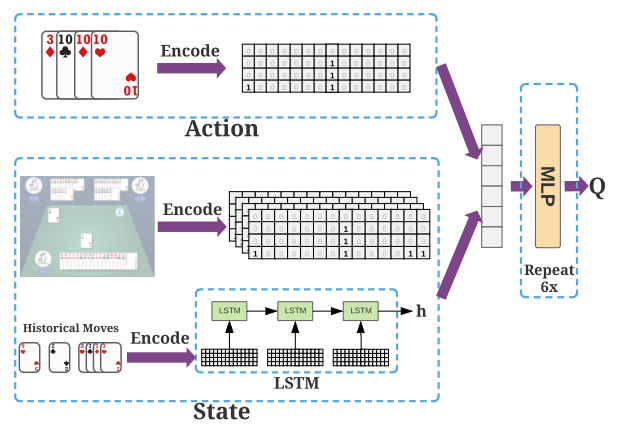

    ### Card Encoding
    - Card Matrix : 15 * 4 - 6 = 54 ( 13張牌 x 4種花色+2張鬼牌 )

    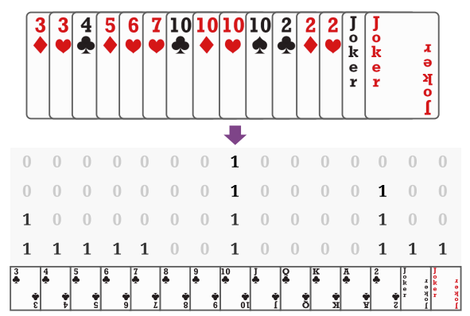

    ### Action and State
    
    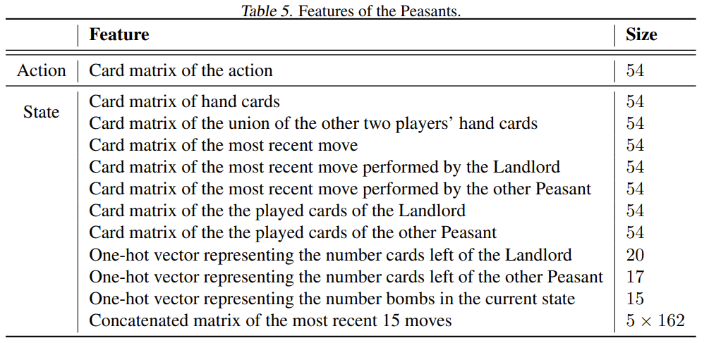

    ### Deep Monte Carlo
    #### 價值估算：
    - DMC：使用深度神經網路估計 Q 值，並根據每集結束時收到的總獎勵來更新它們。
    - DQN：使用貝爾曼方程式和自舉法估計 Q 值並在每一步更新它們。
    #### 獎勵處理：
    - DMC：僅在epilson結束時獲得獎勵，從而導致無偏但高方差的 Q 值估計。
    - DQN：每一步都會獲得獎勵，允許更頻繁的更新，但估計可能存在偏差。
    #### 探索策略：
    - 兩者：使用 epsilon-greedy 進行探索，其中以機率 epsilon 隨機選擇動作，並以機率 1-epsilon 貪婪地選擇動作。  
    #### 應用：
    - DMC：適合情節定義明確且獎勵稀疏的環境。
    - DQN：適用於獎勵頻繁且狀態轉換明確的環境。

    ### Reward
        DouZero 的 reward 設計主要有兩種目標：Winning Percentage (WP) 和 Average Difference in Points (ADP)。以下是這兩種 reward 的設計方式：

    - Winning Percentage (WP): 在遊戲的最後一步，根據代理是否贏得遊戲，給予 +1 或 -1 的 reward。

    - Average Difference in Points (ADP): 直接使用 ADP 作為 reward，這樣可以鼓勵代理在每局遊戲中盡可能多得分。

    ### All legal combinations
    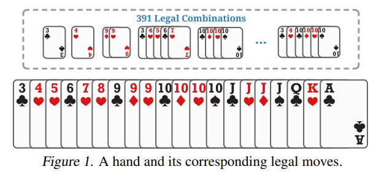

    ### Algorithm
    #### Actor process
    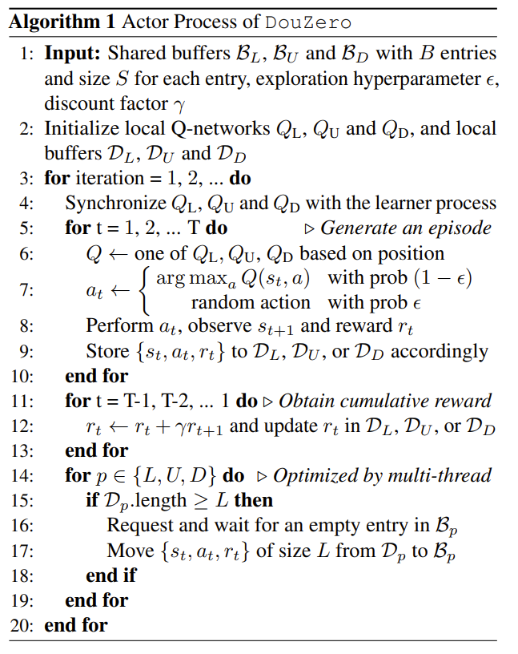

    #### Learner Process of DouZero
    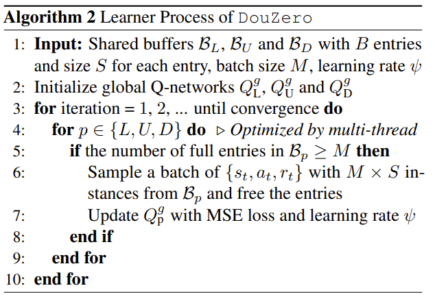

# <a herf="https://github.com/Netease-Games-AI-Lab-Guangzhou/PerfectDou">PerfectDou</a>
- Perfect Information Distillation (完美的資訊蒸餾)
- Card representation
- Model
- Distributed Training Details

    ### Perfect Information Distillation
    #### 集中-訓練-分散-執行 CTDE( centralized-training-decentralized-execution)

        完美資訊蒸餾：在訓練階段，代理商可以利用全局資訊（如其他玩家的手牌）來指導策略的訓練，就像在一個完美資訊遊戲中一樣。而在實際遊戲中，代理人只能使用不完美的資訊來進行決策。
    <!-- 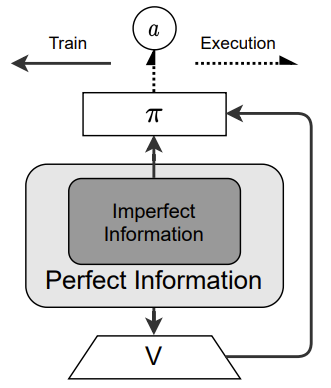 -->
    

    #### 訓練流程
    訓練時使用 Pefect information, 訓練value network.

    #### 訓練時 用  Perfect Information Distillation， 推理時用不完美的，那結果不會很差嗎?

    在訓練時使用完美信息蒸餾（Perfect Information Distillation），而在推理時使用不完美信息，可能看起來會導致性能下降，但實際上這種方法有其優勢。

    主要原因如下：

    * 更好的策略學習：在訓練階段使用完美信息可以幫助模型學習到更好的策略，因為它能夠利用所有可用的信息來進行決策。
    * 提升泛化能力：雖然在推理階段只使用不完美信息，但模型已經在訓練中學會了如何在各種情況下做出最佳決策，這提升了它在實際應用中的泛化能力。
    * 效率更高：這種方法可以顯著提高訓練效率，因為模型在訓練時能夠更快地學習到有效的策略。
    這樣的訓練-推理框架（Perfect-Training-Imperfect-Execution）在多智能體強化學習中已經被證明是有效的，特別是在處理不完美信息遊戲時。你對這個方法有什麼其他疑問或想法嗎？

    ### Card representation (卡牌表示)
    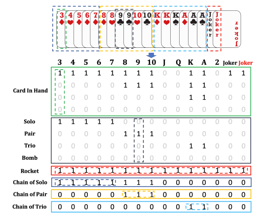
    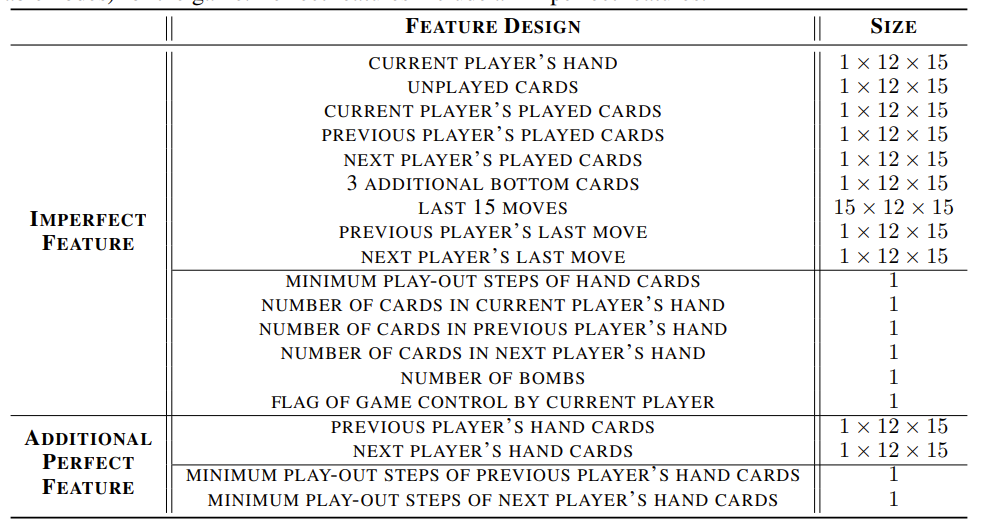

    ### Model

    General actor-critic design PPO + GAE

    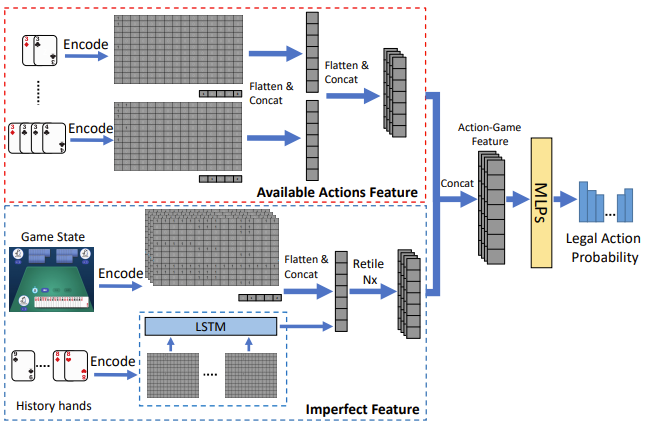
    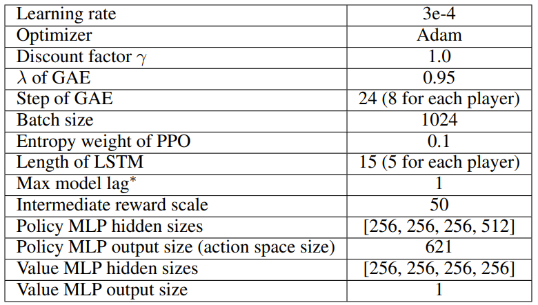

    ### Value network (critic)
    
    訓練時會餵給他完美信息，而在推理時不會。

    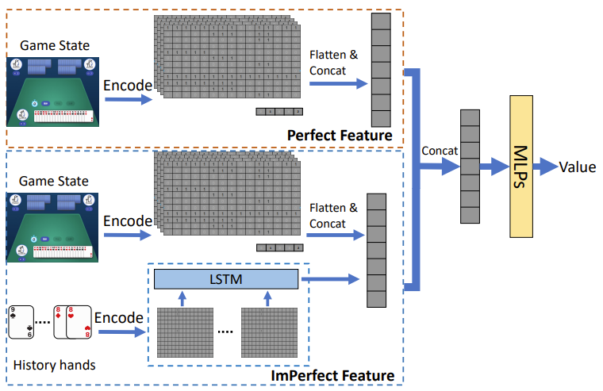

    ### Reward (獎賞)

    其中 l 是比例因子，Nt 是在時間步 t 打出所有牌的最小步驟

    - Oracle Reward: 使用動態規劃算法來計算每個玩家的最小出牌步驟，作為對勝利距離的簡單估計。

    - Advantage Difference: 在每個時間步計算兩個陣營之間的相對優勢差異，並根據這個差異來設計 reward 函數。

    - 地主與農民有不同的reward

    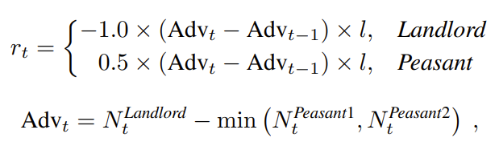

    ### Distributed Training Details
    分散式訓練
    * 每24手 (一人出8次牌) 會抓取最新的模型，

    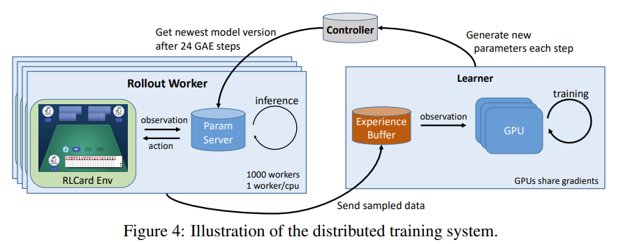

    ### Douzero V.S PerftectDou
    - 性能：PerfectDou 在 10,000 副牌的比賽中擊敗了所有現有的 AI 程式，包括 DouZero，並且在勝率和平均分數差距上都具有顯著優勢。

    - 訓練效率：PerfectDou 的訓練效率更高，使用較少的訓練樣本就能達到比 DouZero 更好的性能。

    - 特徵設計：PerfectDou 使用了完美信息蒸餾技術，在訓練階段利用全局信息來指導- 策略訓練，而 DouZero 則沒有這種設計。

    - 推理時間：PerfectDou 的推理時間稍長於 DouZero，但仍然顯著快於其他 AI 程式，如 DeltaDou 和 CQN。

    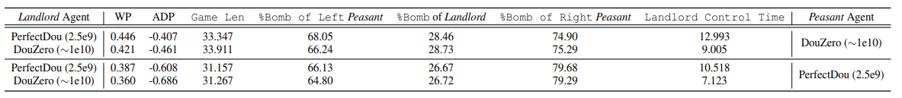