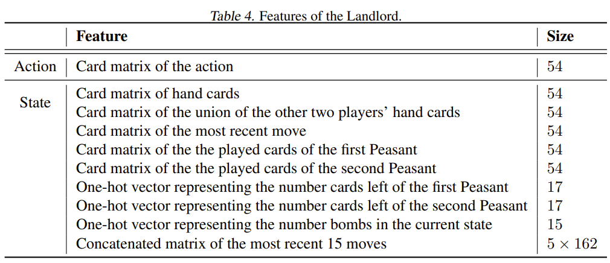

# 鬥地主AI
# <a herf="https://github.com/kwai/DouZero">DouZero</a>
- System design
- Card Encoding
- Action and State
- legal combinations
- Algorithms

    -----

    ### System design
    

    ### Card Encoding
    

    ### Action and State
    
    

    ### All legal combinations
    

    ### Algorithm
    #### Actor process
    

    #### Learner Process of DouZero
    

# <a herf="https://github.com/Netease-Games-AI-Lab-Guangzhou/PerfectDou">PerfectDou</a>
- Perfect Information Distillation (完美的資訊蒸餾)
- System design

    ### Perfect Information Distillation
        完美資訊蒸餾：在訓練階段，代理商可以利用全局資訊（如其他玩家的手牌）來指導策略的訓練，就像在一個完美資訊遊戲中一樣。而在實際遊戲中，代理人只能使用不完美的資訊來進行決策。
    

    

    #### 訓練時 用  Perfect Information Distillation， 推理時用不完美的，那結果不會很差嗎?

    在訓練時使用完美信息蒸餾（Perfect Information Distillation），而在推理時使用不完美信息，可能看起來會導致性能下降，但實際上這種方法有其優勢。

    主要原因如下：

    * 更好的策略學習：在訓練階段使用完美信息可以幫助模型學習到更好的策略，因為它能夠利用所有可用的信息來進行決策。
    * 提升泛化能力：雖然在推理階段只使用不完美信息，但模型已經在訓練中學會了如何在各種情況下做出最佳決策，這提升了它在實際應用中的泛化能力。
    * 效率更高：這種方法可以顯著提高訓練效率，因為模型在訓練時能夠更快地學習到有效的策略。
    這樣的訓練-推理框架（Perfect-Training-Imperfect-Execution）在多智能體強化學習中已經被證明是有效的，特別是在處理不完美信息遊戲時。你對這個方法有什麼其他疑問或想法嗎？

# Card representation

# Model
 general actor-critic design PPO + GAE

